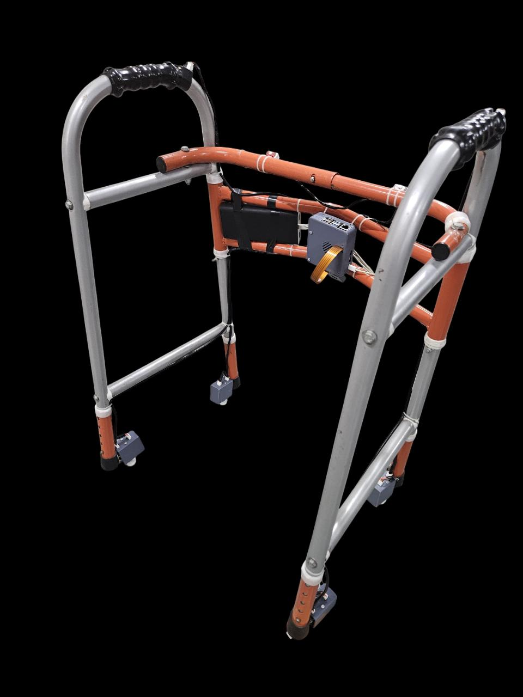
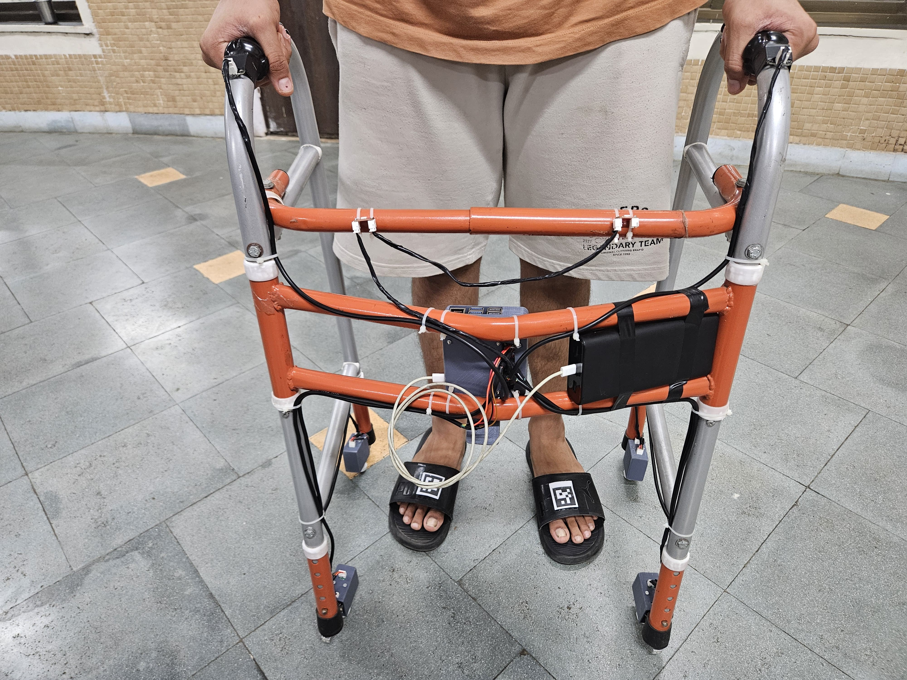

## Project Overview

### Project Name: Smart Walker for Clinical Rehabilitation
### Team Number: TUE-20
### Team Members:
- Rishabh Bhardwaj
- Bhuvansh Goyal
- Sahil Desai
- Sanat Agarwal
- Saarthak Krishan

### Problem Statement and Solution:

Rehabilitation and mobility support for patients with walking difficulties or injuries is often challenging. Incorrect foot placement or uneven weight distribution can delay recovery or even cause further harm.

Our solution: 
A **Smart Walker** that assists elderly individuals and rehabilitating patients in walking correctly by guiding **foot placement**, monitoring **weight distribution**, and providing **real-time feedback** and a report analysing the walking pattern. The goal is to reduce the risk of injury and accelerate the recovery process through intelligent assistance.

 It leverages:
- **Load Sensors** to measure weight distribution on the walker
- **ArUco Marker-Based Foot Detection** for accurate foot placement tracking
- **Raspberry Pi** for onboard processing and feedback control
- **Haptic & Visual Feedback** to guide the user on how to adjust their walking

  
  

By combining these technologies, the Smart Walker provides continuous feedback and helps users build correct walking habits, without the need for constant supervision from a physiotherapist.

This project merges **hardware prototyping**, **computer vision**, and **user-centered design** to deliver a functional and impactful rehabilitation aid.

## Repository Walkthrough
This repository contains all the files related to the design, development, and documentation of the Smart Walker project. Here's a quick overview of the structure:
- src: Codebase for the Raspberry Pi, including foot detection, load cell reading, and feedback logic
- 3d_models: CAD models and STL files used for designing the mechanical enclosures and mounts
- pcb: PCB schematics, Kicad files, and images
- bom.xls: Bill of Materials listing all components used in the final prototype
- reports: Milestone presentations (0 to 4), documenting progress across the semester
- others: Assembly images, connector references, and flow diagrams for the system architecture

## Reflections and Learnings

Throughout the 12-week duration of the EDL course, our team worked on designing and building a **Smart Walker**—a device aimed at aiding individuals recovering from injuries or managing mobility-related disabilities. This journey involved several phases, from ideation and component selection to prototyping and testing. The experience was rich in both technical and managerial learning, and in this section, we reflect on the various aspects of our journey.

---

### Technical Challenges and Learnings

From the outset, we encountered a wide range of technical challenges that tested our problem-solving abilities:

- **Component Selection**: Choosing the right components was critical. We spent considerable time comparing alternatives for load sensors, feedback mechanisms, and embedded computing units before finalizing a setup that balanced performance, cost, and ease of integration.

- **Foot Detection Algorithm**: One of the major technical hurdles was implementing reliable foot detection. Initially, we experimented with various models like YOLO, OpenPose, and MediaPipe. However, these models proved to be inconsistent as they required the full human body to be visible for accurate results. This limitation was not suitable for our use case.

  Eventually, we pivoted to using the **ArUco marker detection library**, which proved to be a game-changer. By placing ArUco markers on the users' shoes, we achieved a much more reliable and consistent method of detecting foot placement.

- **SPI Pin Conflict**: We faced a resource allocation issue with our Raspberry Pi, where the SPI pins required for LED feedback overlapped with those used for load cell interfacing. This required a creative workaround involving alternate method of PIO to ensure all components could function simultaneously.

- **Feedback Mechanism Design**: We had a prolonged discussion on whether to include **visual feedback** (e.g., a screen) for the user. Eventually, we chose to avoid constant visual feedback as it could lead to over-reliance, which is counterproductive for rehabilitation. Instead, we decided to provide visual cues only during the initial training phase, encouraging users to focus on natural walking patterns later on.

- **CAD Modelling**: Designing 3D enclosures for sensitive electronics like the Raspberry Pi and load cells was another important task. We needed to ensure durability, accessibility for maintenance, and ease of mounting onto the walker—all within the constraints of our existing structure.

---

### Managerial Challenges and Team Dynamics

Working in a team comes with its own set of challenges, especially in a project that spans multiple technical domains:

- **Work Distribution**: Balancing responsibilities among team members was difficult, especially since most of us had a heavy course load this semester. Meeting deadlines while ensuring consistent progress on the project required effective time management and mutual cooperation.

- **Design Conflicts**: We often had conflicting views on aspects like CAD structure, detection algorithms, and feedback modalities. While disagreements were frequent, they eventually led to stronger solutions as we combined our perspectives and ideas.

- **Transition from Ideation to Implementation**: Converting an abstract concept into a functional prototype was a significant leap. It involved not just technical execution but also decisions about usability, safety, and user experience—elements we had not fully considered during the initial planning stages.

---

### Human-Centric Learning and Empathy

One of the most profound aspects of this project was developing empathy for our end users. We aimed to design for people who face daily challenges with mobility—be it due to aging, injury, or disability.

- We constantly asked ourselves: *“Would this be helpful for someone trying to walk again?”*  
- Our focus remained on building not just a functional product, but one that genuinely improves the recovery process.
- This mindset influenced many of our design choices and helped us appreciate the importance of **user experience** in engineering design.

---

### Future Scope 
Although we have achieved the primary goals set at the beginning of the semester, there remains significant scope for enhancing the smart walker system. Future improvements could include: 
- Addition of cameras near the feet: Installing two cameras at the base of the walker to monitor the lateral movement of the user's feet for more detailed gait analysis.
- Integration with wheeled walkers: Adapting the Walk-Wise system to work seamlessly with wheel-based walkers to cater to a broader range of users.
- Cloud-based data synchronization: Enabling cloud integration for remote monitoring and long-term data analysis by clinicians.
- Improvement of the HMI (Human-Machine Interface): There is a lot that can be done to make the interface more user-friendly and accessible.

### Final Thoughts

Overall, this project gave us a unique opportunity to blend engineering with empathy. We were exposed to the realities of prototyping under constraints, the complexity of collaborative design, and the importance of user-centric thinking.

Despite the many roadblocks, we were able to build a working prototype that we’re proud of, and we leave this course not just with technical skills, but with a deeper appreciation for how thoughtful design can make a real difference in people's lives.

## Acknowledgments

We thank our course instructor **Prof. Siddharth Tallur**, our project guide **Prof. P.C. Pandey**, and **Prof. Neeta Kanekar** for their valuable insights, continuous guidance, and support throughout the development of this project.

We are also grateful to **Ankur Sir**, **Maheshwar Sir**, the **RAs**, **TAs**, and the **WEL staff** for their hands-on assistance, feedback, and for providing us with the resources and environment needed to bring our idea to life.

